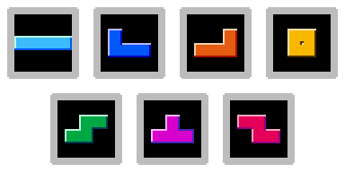
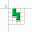
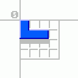

# tetromino
> Minimal data structures for representing [tetrominos](https://en.wikipedia.org/wiki/Tetromino)



## install
```sh
npm install tetromino
```

## usage
```js
const { types, states, blocks } = require('tetromino')
```

A tetromino can be represented as an object with the three fields `type`, `rotation`, and `position`.
```js
var tetromino = {
  type: 'L',
  position: [3, 0],
  rotation: 0
}
```

From this information, we can easily determine the location of each of the four cells that the tetromino occupies.
```js
> blocks(tetromino)
[ [ 3, 1 ], [ 4, 1 ], [ 5, 1 ], [ 5, 0 ] ]
```

### type
The `type` of a tetromino is a single character denoting its unique name. The image at the top of this page lists the tetrominos in the order `[I, J, L, O, S, T, Z]` - in fact, this particular array is exposed as `types`:
```js
> types
[ 'I', 'J', 'L', 'O', 'S', 'T', 'Z' ]
```
A common use case for this array is choosing a random tetromino to spawn.
```js
> types[Math.floor(Math.random() * types.length)]
'S'
```

### position
The `position` of a tetromino is a two-dimensional vector of the form `[x, y]`. Since the center point of each tetromino will vary, `position` is relative to the top-left point of the 4x4 region containing the piece.



### rotation
A tetromino's `rotation` is a zero-based index corresponding to a "rotation state" found in `states`. Most tetrominos have 4 rotation states, with the `O` piece being the exception. It only has one state and therefore cannot rotate.
```js
> states.T.length
4

> states.O.length
1
```



### states
The `states` object details the locations of each cell of a tetromino with a given type and rotation in compliance with the [SRS](http://tetris.wikia.com/wiki/SRS). It is used internally in the `blocks` function mentioned above.

Use `states` by specifying both [a tetromino type](#type) and [a rotation index](#rotation).
```js
> states.J[0]
[ [ 0, 1 ], [ 1, 1 ], [ 2, 1 ], [ 2, 0 ] ]
```

## license
[MIT](https://opensource.org/licenses/MIT) © [Brandon Semilla](https://git.io/semibran)
