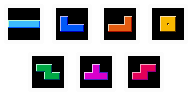

# tetromino
> Minimal data structures for representing tetrominos



A tetromino can be represented as an object with three properties: `type`, `rotation`, and `position`. From this information, we can deduce the location of each of the four cells that the tetromino occupies (i.e. `blocks`).

The `type` of a tetromino is its single character name. In the above image, they are listed in the order `['I', 'J', 'L', 'O', 'S', 'T', 'Z']`. This particular array can be accessed via `Tetromino.types`.

A tetromino's `rotation` is a zero-based index corresponding to a "rotation state" found in `Tetromino.states[type]`. Most tetrominos have 4 rotation states, with the `O` piece being the exception. It only has one state and therefore cannot rotate.

The `position` of a tetromino is a vector with components `x` and `y` (e.g. `{ x: 3, y: 0 }`). Since the center point of each tetromino will vary, `position` is relative to the top-left point of the 4x4 region containing the piece. The `Tetromino.states` object details the locations of each cell of the desired piece relative to this point in compliance with the [SRS](http://tetris.wikia.com/wiki/SRS).

## install
```sh
npm install tetromino
```

## license
MIT
